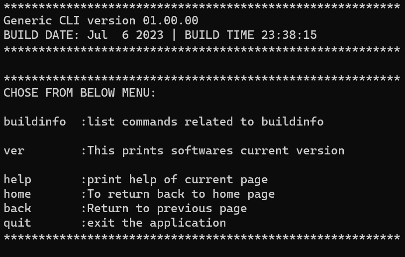
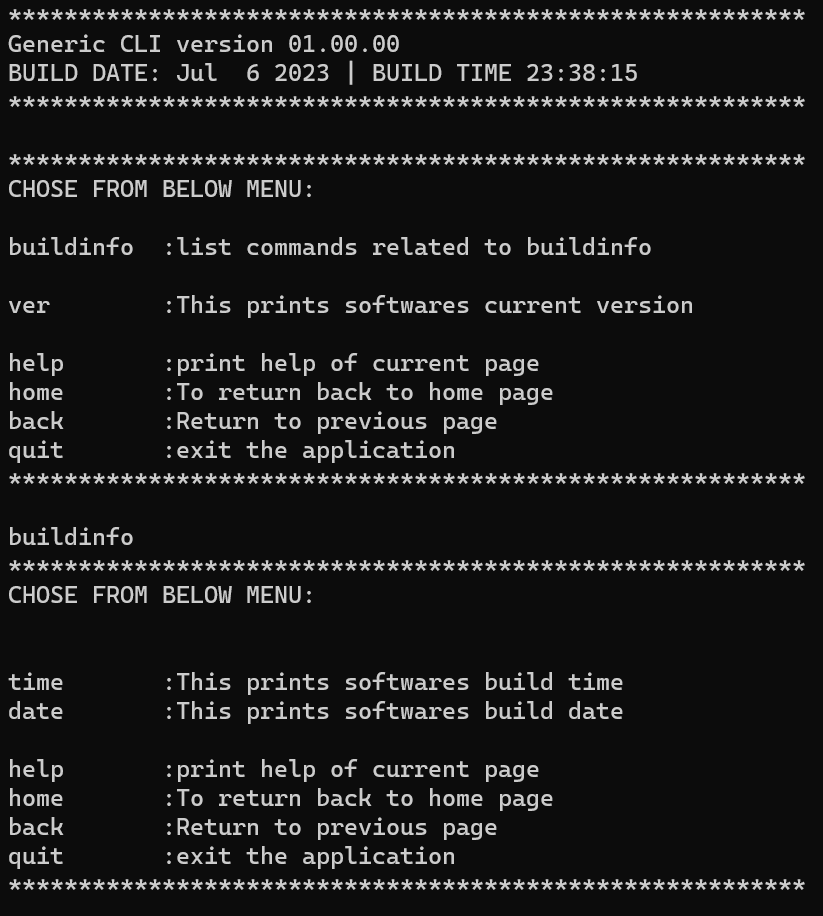

# gen_cli
generic CLI with easy configurabilty for windows and Linux made in C.

Simple to configure a new command or page to the command line interface module. Works with input from STDIO.
Compatible with Linux ,windows and Android native. 

## Building

```shell
mkdir build 
cd build 

cmake ../
make

NOTE: for MIN GW in windows use the following command
cmake -G "MinGW Makefiles" ../
make

```
## API Usage

* To add a new command use the below macro   
`COMMAND(COMMAND_NAME, EXPECTED_ARGUMENT_COUNT, HELP_STRING, Advanced help)`  

* Each command must have its own command function which will be triggered when the command is entered by the user    
`CMDFUNC(COMMAND_NAME)`

* To add a new page use the below macro    
`PAGE(PAGE_NAME, PAGE_HELP_STRING, POINTER_TO_PAGE)`

* Check [example](https://github.com/ajaykrishna97/gen_cli/blob/main/CLI/src/main.c) for sample API usage.

## Sample screenshots






<!-- LICENSE -->
## License

Distributed under the Apache-2.0 License. See `LICENSE` for more information.


